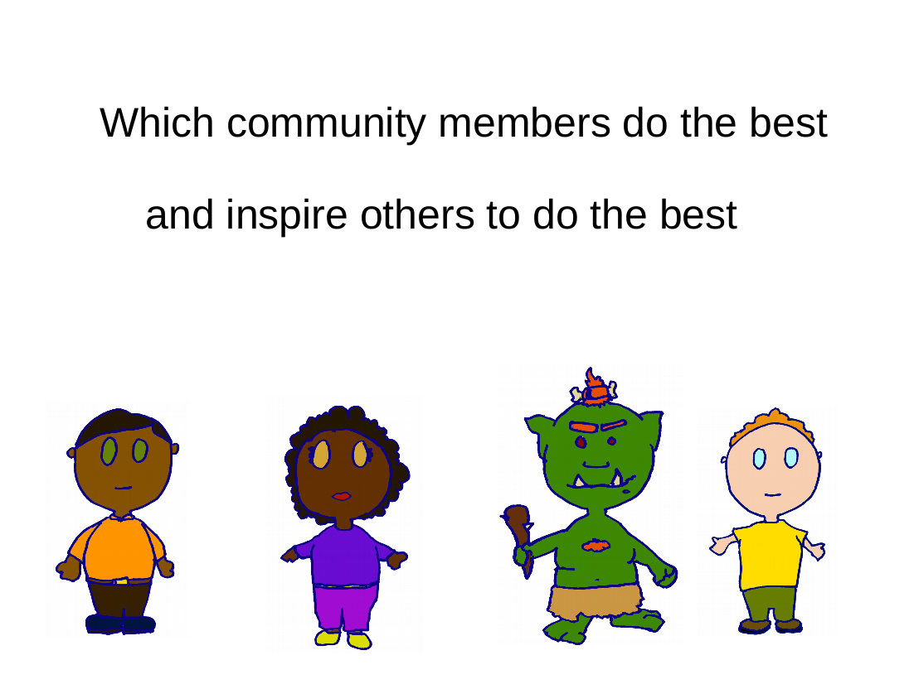
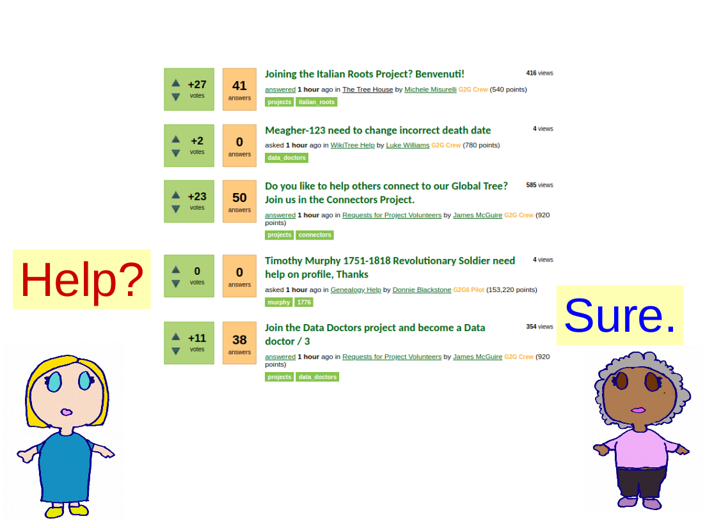
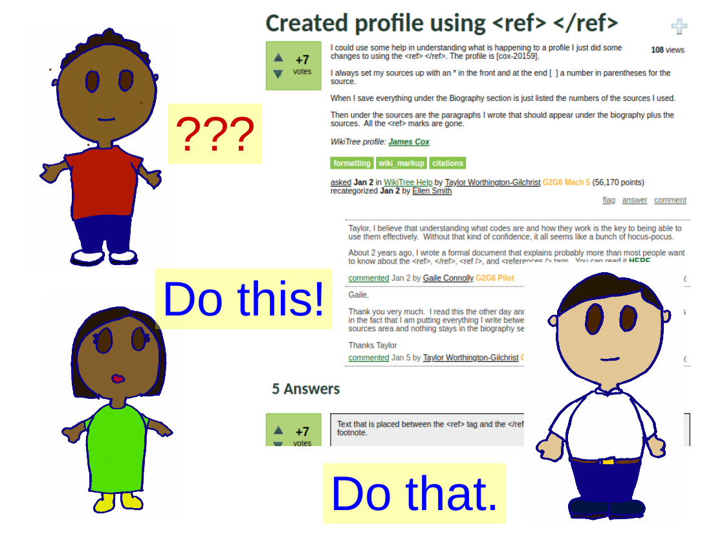
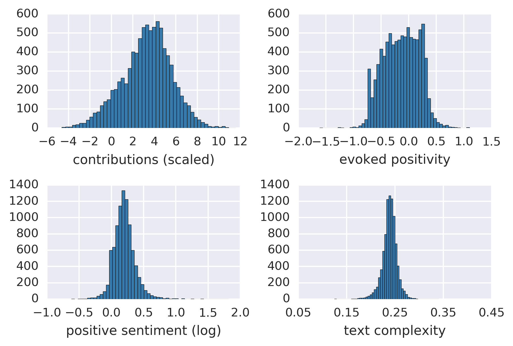
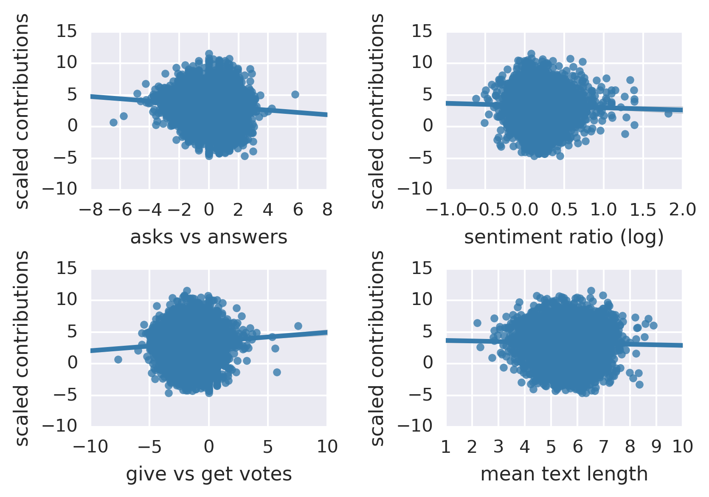
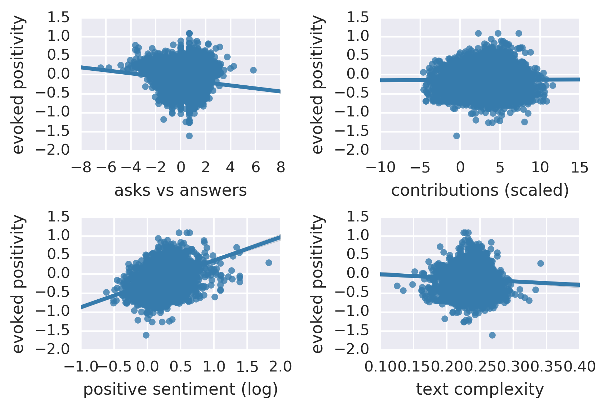

## Using machine learning on the output of an online community to try to predict the most productive users, and those that help others be productive

In any collaborative setting, some people are more or less productive, and others facilitate (or degrade) the social environment. Using a large set of data, scraped from a community website:

* Developed 14 metrics of positive sociability, and productivity.
* Trained machine learning pipelines to predict future users' sociability and productivity scores with scores of __0.593__ and __0.835__ respectively.
* This will help to automatically recognize 'community stars' with new members, or flag emerging problems for intervention.



___Goal: to understand how users of an online community interact, and the degree to which interaction styles affect positivity and productivity___

* Used an online genealogy website as a test case <www.wikitree.com>.
    * a different demographic than the common "young, white, male" user base.
    * focused on collaborative and interactive projects. 
* Users have public IDs, which allow us to track their contributions and comments
* Looked at users' contributions (numbers of edits, thanks given and received).
* Looked at user' interactions.  
    * The question and answer forum G2G has 10+ years of individual users questions and responses.



___Data: Collected user summary statistics, and scraped the discussion board for all question, answer, and comment texts___

* A large dataset
    * __16,542__ users ( __9004__ after restricting the analysis to moderately active users)
    * __69,630__ questions
    * __434,630__ total texts (questions, answers, comments)
* A rich data set.
    * Users can be associated with productivity data across time.
    * Users have profiles recording the positive and negative responses they elicit.
    * Users can be associated with individual texts.
    * Texts can be scored for complexity.
    * Sentiment analysis can be performed on texts.



___Measurement: Metrics were selected to reflect several predicted domains of performance and sociability___

* __Productivity__ How much did a user contribute? For how long?
    * ```commit length``` : how long (days) was their active period (defined as days between first and third quartiles of posts)?
    * ```text persist``` : how many contributions do they make in the latter portion of their active period relative to the first? 
    * ```scaled writs``` : rate of production of questions, answers, comments (G2G).
    * ```contributions (log)``` : the overall log number of contributions made.
    * ```scaled contributions``` : how much genealogical work did they do, scaled by the length of their tenure?
* __Positivity__ How positive was a user, and how much positivity did they elicit?
    * ```positive sentiment (log)``` : how positive are a user's texts?
    * ```upvotes gave``` : what ratio of upvotes does a user give?
    * ```upvotes gotten``` : what ratio of upvotes does a user get? 
    * ```contextual positivity``` : how much more positive is a focal user than the other people they're interacting with, across all the posts they've contributed to?
    * ```evoked positivity``` : after subtracting a focal user's contribution, how positive is the sentiment of the posts they contribute to?
* __Helping__ How much did a user demand of others, or offer assistance?
    * ```asks vs answers``` : how many questions asked, relative to help offered.
    * ```scaled thanks``` : how many thanks did a user receive?
    * ```give vs get votes``` : how many questions and responses did they vote on, vs receiving votes?
* __Sophistication__ How 'smart' was a user, judging by their texts?
    * ```text complexity``` : how many syllables are the words they use on average (divided by text length (characters).
    * ```mean text length``` : how long (characters) was their mean text?
    
Note that 'scaled' means scaled by the duration of the user's active period (not the period since they opened the account). All proportions were logit transformed, and all counts and ratios were log transformed (after ensuring this was appropriate, given the empirical distributions).



___There was a large range of differences among users for all the measures we considered ___

* focal outcome variables: 
    * ```scaled contributions``` : the total number of contributions (edits) made, controlling for the duration of a users' participation. More productive users have a much 
    * ```evoked positivity``` : after subtracting a user's direct contributions, what was the mean positivity score of the texts of all the other users in a question-answer interaction.



___There were strong correlations between productivity and some measures (like ```give vs get votes```), and weak correlations (```mean text length```) with others___



___There were strong correlations between evoked positivity and some measures (like ```positive sentiment```), and weak correlations (```text complexity```) with others___

```python
pipeline_sentiment = Pipeline([
    ('rescale', StandardScaler()),
    ('pca', PCA(12)),
    ('random_forest', ensemble.RandomForestRegressor(n_estimators = 1000, min_samples_split = 10))
    ])

pipeline_sentiment.fit(X_train, y_train)
print pipeline_sentiment.score(X_test, y_test)

```

___A simple pipeline, using a Principal Components transformation, and Random Forest Regression performed well___

* Considered only time insensitive measures of performance (excluding, for instance, ```log contributions```) ensures that the trained models can be used on relatively new users
* Had an r-square (score) of __0.593__ for the evoked positivity predictor.
* Had an r-square (score) of __0.835__ for the productivity predictor.
